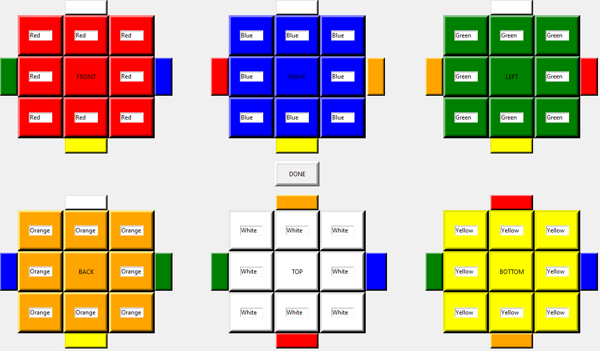
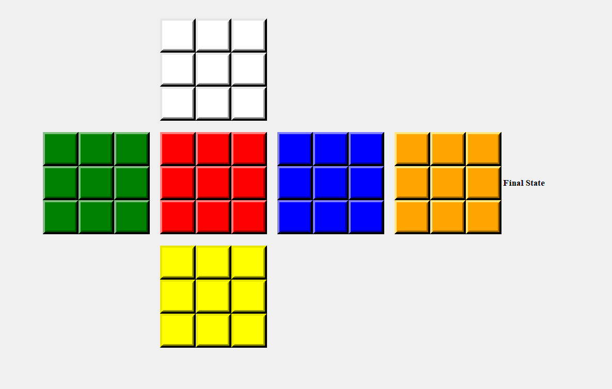

# Rubik's Cube Solver (Spring 2019)

## Team Members
1. Fasih Hussain
2. Ali Haider Rizvi
3. Ahsan Ali

## Description
The program `app.py` first taken an input for a valid Rubik's Cube state as shown below and also verifies if the input sequence is a valid state.

Once the input has been accepted the program show steps to solve the Rubik's cube while show the current cube state as well. It uses a layer-by-layer algorithm to solve the Rubik's cube.

The images for possible moves of the Rubik's cube are in `moves/`.

Other combinatorial approaches have also been implemented as any Rubik's cube can be solve in 20 moves but it was not able to execute in reasonable amount of time.